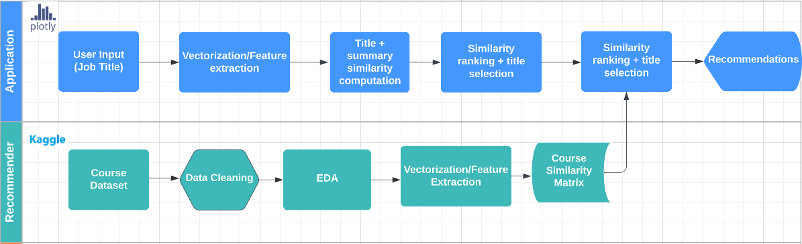
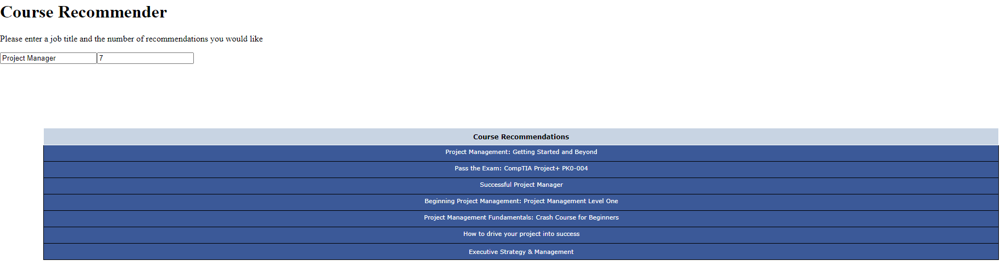

# Course-Recommender-System-Capstone
<i>Asia Paige, Chauncey Raggie, Thomas James</i>

When you’re thinking about switching careers or up-skilling to move up in your industry, it can be overwhelming identifying the skills needed for a desired job and searching for courses that will help give you those skills. Usually, this process requires multiple searches across multiple websites which leads to multiple tabs. Our project aims to address this problem by creating a recommendation system that takes job titles as the input and recommends relevant courses that may help an individual gain skills as the output.

The literature we reviewed presented attempts using skilled based approaches i.e. by taking job skills as the input and recommending courses as the output.  Our goal in this project is to see if it’s possible to take job titles that may not have direct correlation to course summaries like skills do, and recommend relevant courses. This project is an information retrieval task.

### Table of Contents
- [Introduction](#Introduction)
- [Data Sources](#Data)
- [Installation](#Installation)
- [Usage](#Usage)
- [Contributing](#Contributing)
- [License](#License)

### Introduction
In this project, we aim to analyze the data to answer a specific research question or solve a specific problem. We used various data science techniques and tools to collect, process, and analyze data. The findings of the project are documented in a Jupyter Notebook, which is included in this repository.

### Data Sources
Source 1: Job description data from the [O*NET 27.2 Database](https://www.onetcenter.org/database.html#task). Original source: [the U.S. Department of Labor, Employment and Training Administration](https://www.dol.gov/agencies/eta)

Features

- O*NET-SOC Code: Occupation Code 
- Title: Occupation title
- Task ID:	Identifies each task
- Task: Task statement associated with an occupation
- Task Type:	“Core” or “Supplemental”
- Incumbents Responding: Number of incumbents providing task information
- Date:	Date when data was updated
- Domain Source:	Source of the data

Source 2: Udemy Course Enrollment Information [Dataset](https://www.kaggle.com/datasets/songseungwon/2020-udemy-courses-dataset?select=udemy_finance.csv) from Kaggle

This data set contains data for about 42K(42,432) courses based on 9 categories. The data was collected using a Python scraper coded with selenium, bs4, etc.
The 9 course categories are; Business, Design, Finance, Marketing, Productivity, Photography, Lifestyle, Music and Tech. 

Features

- Index : Index of rows
- Title : Title of Course
- Summary : Summary information of the course
- Enrollment : The cumulative number of students in the course
- Stars : The number of ratings (reviews) of the course
- Rating : Average rating for the course
- Link : Link to detail page of the course

## Recommended System Requirements
To run this project, you'll need the following:

- Python 3.6 or higher
- 32GB of RAM or more

### Installation
- Clone the repository
- Install the required packages using pip install -r requirements.txt

You will also need to have software installed to run and execute a [Jupyter Notebook](http://ipython.org/notebook.html)

If you do not have Python installed yet, it is highly recommended that you install the [Anaconda](http://continuum.io/downloads) distribution of Python, which already has the above packages and more included. 

### How to run the app locally
- run 'Pickle File Creation Instructions.ipynb' notebook to create pickle file
- run rec_app_2.py in IDE of your choice

### Contributing
We welcome contributions from anyone. To report issues or request new features, please use the issue tracker. If you'd like to contribute code, please fork the repository and submit a pull request.

### Developer Notes 
- Make sure to push into the `dev` branch only.
- `git checkout dev` (will switch your active branch to be dev locally)
- Before pushing your code with the downloaded data, make sure to run `git pull`. (this will download the latest changes locally for you, and avoid merge conflicts)
- `git commit -m "<a few words on what is pushed>"`
- `git add .` adds all in all the changes
- `git push` to push the code into the `dev` branch repository

### License
This project is licensed under the MIT License.

### Project Structure 

    

### Course Recommender application UI

    

